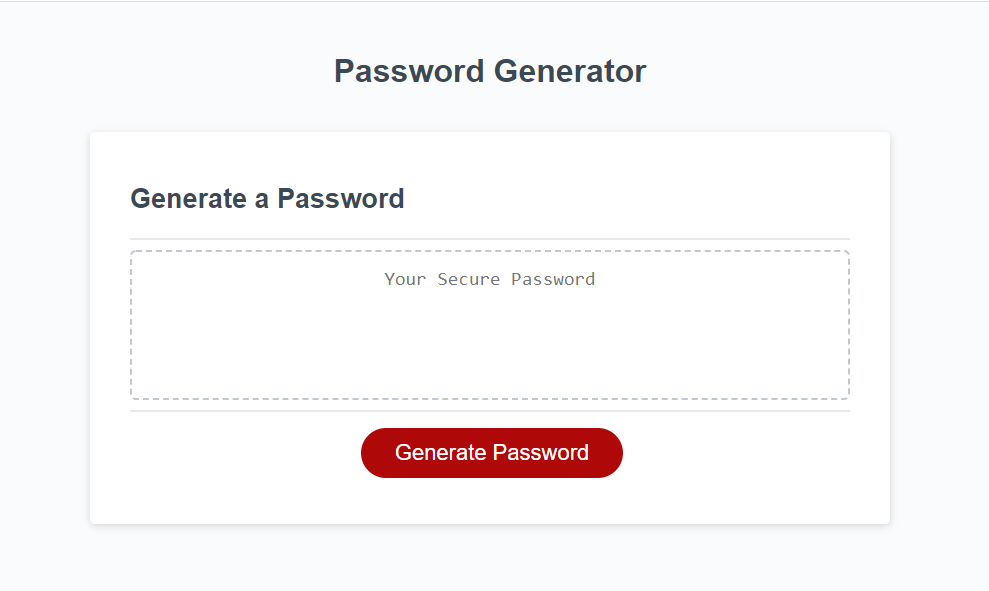
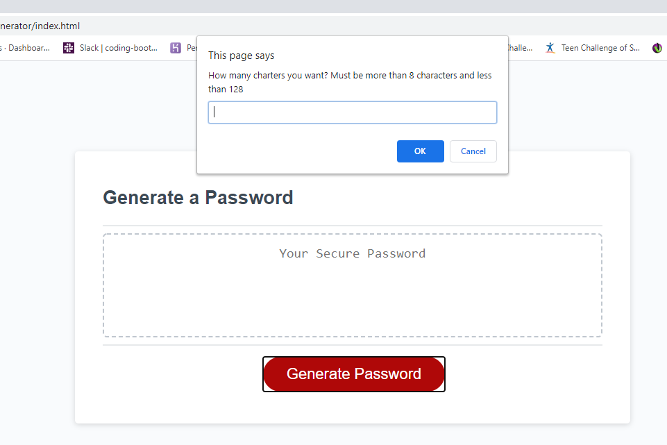
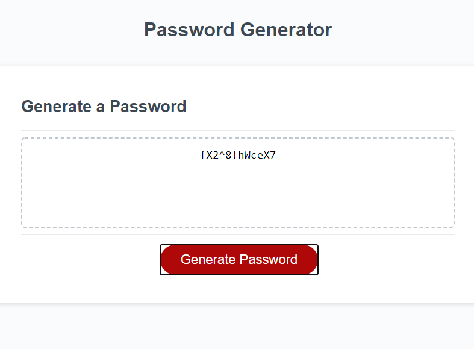

# Password-Generator
In Browser password generator.

<a href="https://justinbrubaker7.github.io/Password-Generator/">Live Application</a>

  This is the landing page. It is responsive and fits mobile as well as desktop well.
  

  Series of prompts ask how many characters you would like and if you would like special characters, numbers and/or capitol letters.
  

  Your password is generated automatically. and populated in the screen
  

